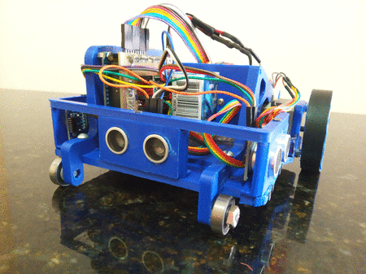

# OBR-VMRT-2020
SESI VMRT code for the OBR 2020

# The Robot

# Motors and sensors ports

# Presentation Video
this video below was used for the Brazilian Robotics Olympics, in the Virtual Practical Mode of 2020

<iframe width="560" height="315" src="https://www.youtube.com/embed/gncmIylY5fE" frameborder="0" allow="accelerometer; autoplay; clipboard-write; encrypted-media; gyroscope; picture-in-picture" allowfullscreen></iframe>
